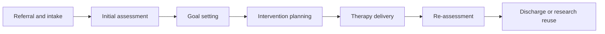
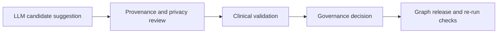

# Enterprise model views

This file summarizes the enterprise-modeling views represented by the
rehabilitation SEKG proof of concept.

## Contribution focus

The SEKG is not only a clinical-data knowledge graph. It is a semantic
enterprise model of a rehabilitation center: it connects clinical cases,
sensor records, observed variables, departments, roles,
responsibilities, care processes, provenance, standards alignment, and
human-LLM governance decisions.

The project uses a lightweight RDF-native enterprise metamodel. It is
conceptually aligned with enterprise architecture ideas such as actors,
roles, processes, goals, and controls, but it is not a full ArchiMate,
DEMO, BPMN, or TOGAF model.

## Organization-to-graph mapping

| Enterprise view | SEKG representation |
| --- | --- |
| Department | `sekg:Department` |
| Human or computational role | `sekg:EnterpriseRole`, `sekg:ProfessionalRole`, `sekg:ComputationalAssistantRole` |
| Role responsibility | `sekg:enterpriseResponsibility` |
| Care or governance process | `sekg:EnterpriseProcess` |
| Process step | `sekg:WorkflowStage` |
| Responsible actor for step | `sekg:stageResponsibleRole` |
| Value or outcome | `sekg:ValueProposition` |
| Source evidence | `sekg:DataSource`, `sekg:RepresentativeRecord` |
| Measured or documented field | `sekg:ObservedVariable` |

## Care pathway view

## Governance view

## Role-responsibility view

| Role | Department | Responsibility |
| --- | --- | --- |
| Physiotherapist | Physiotherapy; gait and movement analysis | Interprets physiotherapy cases, gait information, sensor measurements, and exercise variables. |
| Occupational therapist | Occupational therapy | Interprets occupational therapy assessments, activities of daily living, cognition, participation, and intervention focus. |
| Clinical data steward | Clinical data governance office | Checks source provenance, privacy treatment, sample documentation, and data-to-ontology traceability. |
| Rehabilitation domain expert | Clinical data governance office | Validates clinical meaning, organizational fit, ontology mappings, and accepted graph changes. |
| LLM modeling assistant | Clinical data governance office | Suggests candidate ontology concepts, mappings, documentation, and SPARQL queries for human review. |

## Standards positioning

| Standard or terminology | SEKG relationship |
| --- | --- |
| FHIR | Reference for clinical data exchange. The SEKG can link to FHIR resources rather than replace FHIR. |
| ICF | Reference for functioning, activity, participation, and environmental-factor classification. |
| UMLS | Reference for biomedical terminology integration and concept normalization. |
| SNOMED CT | Reference for clinical terminology alignment where licensing and implementation context permit it. |

## Value view

The modeled value proposition is coordinated interdisciplinary
rehabilitation. The SEKG supports this by making cases, assessments,
functional domains, sensor evidence, roles, provenance, and governance
decisions semantically traceable across the organization.
